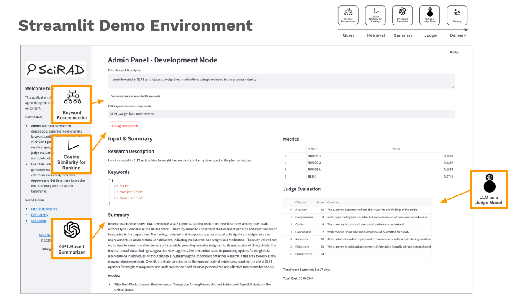
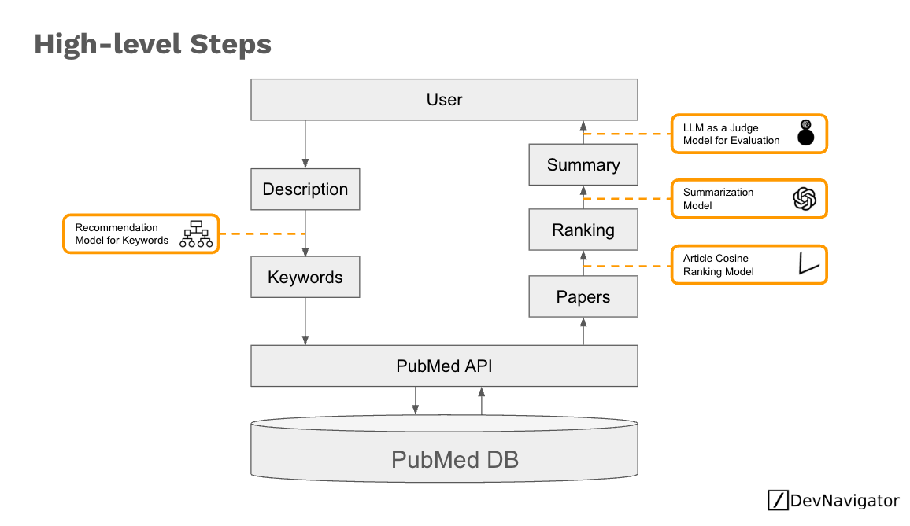

# SciRAD: Retrieval, Aggregation, and Delivery of Scientific Article Summaries

---

SciRAD is an intelligent research agentic framework designed to assist scientists and researchers by automatically retrieving, ranking, and summarizing scientific literature into bite-size pieces to stay up to date. Using advanced language models and configurable prompting techniques, SciRAD can generate concise summaries, compute performance metrics, and even evaluate the quality of its own summaries, all while tracking experiments via MLflow.

## Overview

SciRAD streamlines the process of literature review and synthesis by:
- **Querying PubMed:** Searches for relevant scientific articles using user-defined keywords and descriptions.
- **Ranking Articles:** Calculates semantic similarity scores between user input and article abstracts to rank papers by relevance.
- **Summarization:** Generates coherent, high-quality summaries by leveraging configurable prompting methods (e.g., Chain of Thought, Tree of Thought).
- **Evaluation:** Computes quality metrics (ROUGE, BLEU, etc.) and uses a secondary judge agent to assess the summary’s clarity, accuracy, and objectivity.
- **Multiple Interfaces:** SciRAD is accessible via a Streamlit interface, a Flask API, as well as a packaged PyPi distribution, and comes with a comprehensive test suite.



## How It Works

1. **PubMed Search:**  
   SciRAD uses the supplied description to generate keywords to query PubMed via the NCBI E-utilities API. It retrieves details such as titles, abstracts, and publication dates and many others.
   
2. **Ranking & Similarity:**  
   The agent computes embeddings for both the user’s description and the article abstracts. It uses cosine similarity to rank the articles by relevance.
   
3. **Summarization:**  
   Based on the selected prompting method (e.g., Chain of Thought), SciRAD crafts a detailed yet concise summary that highlights key findings, methodologies, and implications.
   
4. **Evaluation:**  
   The system calculates metrics like ROUGE and BLEU, and even solicits evaluation from a dedicated LLM-as-a-judge model to provide insights into the summary’s quality.
   
5. **Flexible Deployment:**  
   Whether you prefer a web interface (Streamlit), an API (Flask), or using SciRAD as a Python package, the tool is designed to adapt to various research workflows.



## Quick Start

### Prerequisites
- Python 3.8 or newer.
- An OpenAI API key (set in your `.env` file as `OPENAI_API_KEY`).
- Install the required dependencies via:
  
  ```bash
  pip install -r requirements.txt
  ```

### Running the Streamlit App
SciRAD includes a Streamlit front-end to visualize and interact with the summarization process.
1. **Install Streamlit (if not already installed):**
   ```bash
   pip install streamlit
   ```
2. **Run the Streamlit app:**
   ```bash
   streamlit run streamlit_app.py
   ```

### Running the Flask API
SciRAD provides a Flask API that exposes the summarization functionality.
1. **Navigate to the API directory:**
   ```bash
   cd src/api
   ```
2. **Start the API:**
   ```bash
   python agent_api.py
   ```
   The API will run at `http://localhost:5001`.  
3. **Sample cURL Request:**
   ```bash
   curl -X POST http://localhost:5001/summarize \
     -H "Content-Type: application/json" \
     -d '{
           "keywords": ["AI", "protein", "folding"],
           "description": "Recent advancements using artificial intelligence to accurately predict complex protein-folding structures.",
           "model_name": "gpt-3.5-turbo",
           "temperature": 0.5,
           "top_p": 1.0,
           "summary_word_count": 300,
           "prompting_method": "Chain of Thought",
           "enable_ranking": false
         }'
   ```

### Running the Test Suite
A comprehensive set of tests is included to validate API endpoints and core functionality.
1. **Install pytest (if not already installed):**
   ```bash
   pip install pytest
   ```
2. **Run tests:**
   ```bash
   pytest
   ```
   *Note:* If you experience rate-limit issues during tests, you may want to use the provided global delay (in `conftest.py`) or mock external API calls.

### Installing the PyPi Package
SciRAD is also available as a PyPi package:
1. **Install the package:**
   ```bash
   pip install scirad # Not online yet!
   
   python setup.py sdist bdist_wheel
   pip install build
   python -m build
   pip uninstall scirad
   pip install dist/scirad-0.1.1‑py3-none-any.whl

   ```
2. **Example Usage:**
   ```python
   from scirad import IntelligentAgent

   agent = IntelligentAgent(
       keywords=["AI", "protein", "folding"],
       description="Recent advancements using artificial intelligence to accurately predict complex protein-folding structures.",
       model_name="gpt-3.5-turbo",
       temperature=0.5,
       top_p=1.0,
       summary_word_count=300,
       prompting_method="Chain of Thought",
       enable_ranking=False
   )
   result = agent.process()
   print("Summary:", result["summary"])
   ```

